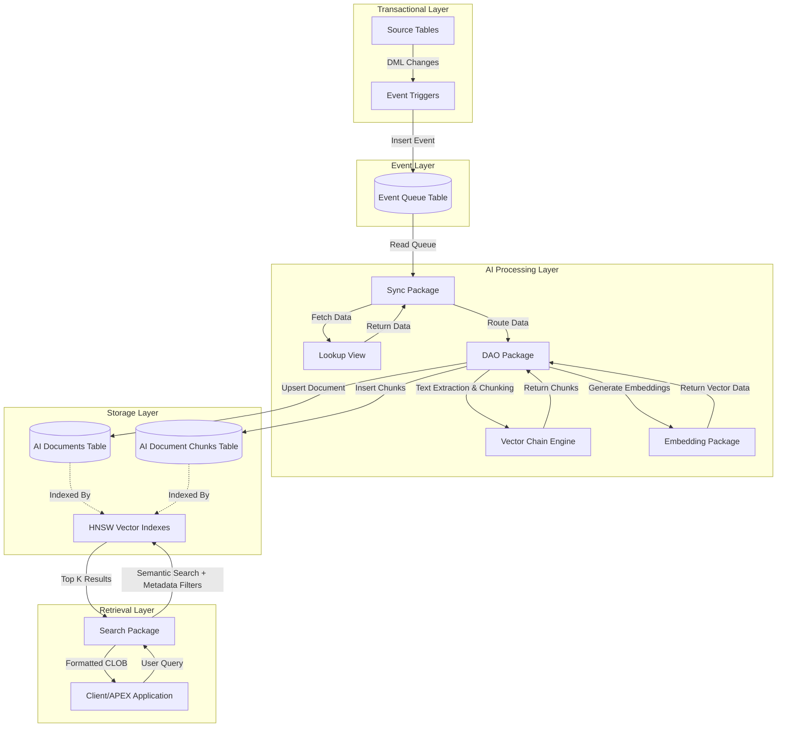

# System Architecture

The Oracle Vector Search RAG Toolkit is designed as a robust, decoupled, and event-driven platform. It leverages the latest AI capabilities of Oracle Database 26ai, maintaining strict transactional integrity while performing computationally heavy NLP operations.

## Core Components

The architecture consists of several key components, each handling a specific domain of the RAG lifecycle:

### 1. Source Integration Layer
- **Source Tables**: Standard relational tables (e.g., patient records, diagnosis logs, binary document stores).
- **Event Triggers**: `AFTER INSERT OR UPDATE OR DELETE` triggers attached to source tables. They capture changes and securely push events to the `AI_SEC_RAG_SYSTEM_L_EVENT` queue.
- **Lookup View**: `AI_SEC_SYS_VIEW_PATIENT_FULL_HISTORY_LOOKUP` provides a unified, structured interface abstracting the complexity of disparate source tables into a single readable stream.

### 2. Event Processing Engine
- **Event Queue (`AI_SEC_RAG_SYSTEM_L_EVENT`)**: Acts as the buffer between synchronous transactional data entry and asynchronous AI processing. It prevents slow embedding operations from blocking user transactions in Oracle APEX.
- **Sync Package (`AI_SEC_RAG_SYSTEM_ALL_SUB_SYNC_PKG`)**: Background processes read `NEW` events, extract the payload, invoke the DAO package to process the document, and mark the event as `PROCESSED` or `FAILED`.

### 3. Document Processing Pipeline
- **Document Master (`AI_SEC_RAG_SYSTEM_L_HELP_AI_DOCUMENTS`)**: Central repository for full documents, metadata, and document-level embeddings.
- **Chunking Engine**: Handled dynamically by `DBMS_VECTOR_CHAIN.UTL_TO_CHUNKS`. It analyzes BLOBs (using `UTL_TO_TEXT`) or large CLOBs and splits them into meaningful chunks based on word count (e.g., 500 words with a 50-word overlap).
- **Chunk Store (`AI_SEC_RAG_SYSTEM_L_HELP_AI_DOCUMENT_CHUNKS`)**: Stores the segmented text. This enables highly granular semantic search, allowing the system to pinpoint the exact paragraph answering a user's question, rather than returning a 50-page document.

### 4. Vector and Embedding Subsystem
- **Embedding Generation**: Managed by `AI_SEC_RAG_SYSTEM_ALL_SUB_EMBED_PKG`. It securely invokes Oracle's `DBMS_VECTOR.UTL_TO_EMBEDDING` (utilizing the `E5_SMALL` model).
- **Vector Storage**: Vectors are stored natively using the `VECTOR(384, FLOAT32)` data type.
- **Vector Indexes**: To guarantee millisecond retrieval speeds across millions of vectors, the system utilizes **Hierarchical Navigable Small World (HNSW)** indexes configured with `DISTANCE COSINE`.

### 5. Hybrid Retrieval Engine
- **Search Package (`AI_SEC_RAG_SYSTEM_ALL_SUB_SEARCH_PKG`)**: Takes a user query, converts it to an embedding, and performs a combined similarity search against both document-level and chunk-level embeddings. It then uses SQL `JOIN`s to apply relational metadata filters (e.g., filtering by a specific `PATIENT_ID`).

## Mermaid Architecture Diagram

## Why this Architecture?

1. **Performance**: Separating document ingestion from embedding generation via an event queue ensures your primary OLTP applications remain blazingly fast.
2. **Precision**: By implementing document chunking, the Search Engine provides highly localized and accurate answers to LLMs, reducing hallucination.
3. **Scalability**: Natively utilizing HNSW Vector Indexes allows the RAG system to scale horizontally to tens of millions of documents.
