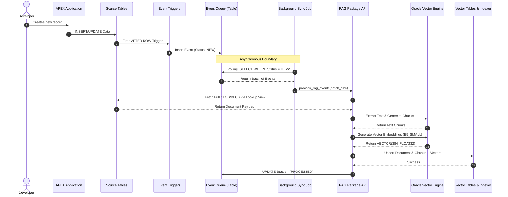
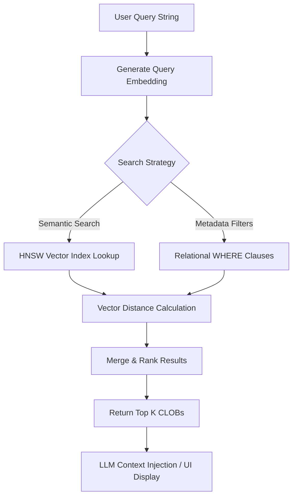

# Data Flow Diagrams

This document contains Mermaid sequence and flow diagrams detailing how data moves through the RAG Toolkit.

## Data Ingestion & Background Sync Sequence

## Hybrid Search Flow

